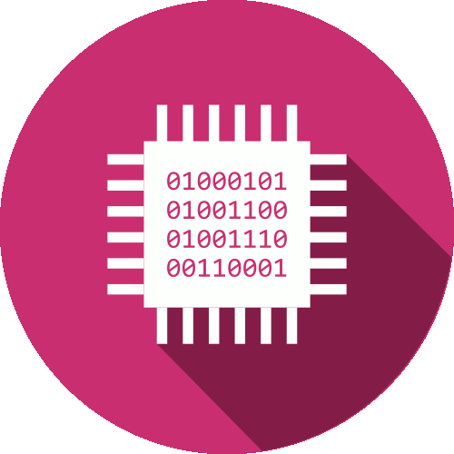

<h1 align="center">
  <br>
  
  <br>
  HEI-VS DiD Laboratory Project
  <br>
</h1>

## Description

HDL-Project for all laboratories in the course DiD Digital Design

## How to use

Simply clone or download the repository.

### Windows

  ```bash
  mkdir -p c:/work
  cd /d c:/work
  git clone https://github.com/hei-synd-did/did-labs.git
  cd did-labs
  ```

### Linux & Mac

  ```bash
  # clone repo
  mkdir -p ~/work
  cd ~/work
  git clone https://github.com/hei-synd-did/did-labs.git
  cd did-labs
  ```

## Credits

* ZaS
* AmA

## Find us on

[hevs.ch](https://www.hevs.ch) &nbsp;&middot;&nbsp;
Facebook [@hessovalais](https://www.facebook.com/hessovalais) &nbsp;&middot;&nbsp;
Twitter [@hessovalais](https://twitter.com/hessovalais) &nbsp;&middot;&nbsp;
LinkedIn [HES-SO Valais-Wallis](https://www.linkedin.com/groups/104343/) &nbsp;&middot;&nbsp;
Youtube [HES-SO Valais-Wallis](https://www.youtube.com/user/HESSOVS)
